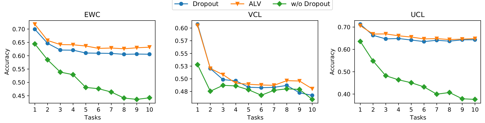
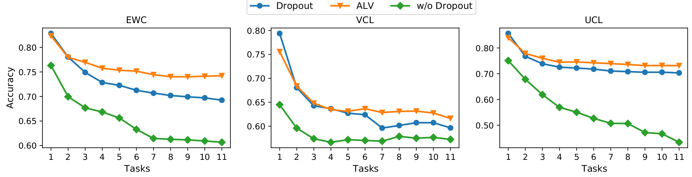
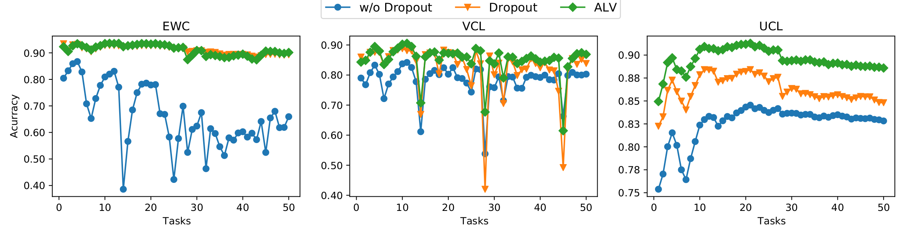

# Auxiliary Local Variables for Improving Regularization/Prior Approach in Continual Learning

This repository contains the code for ALV. ALV is a method that can boost the performance of regularization-based methods in continual learning using novel auxiliary variables. The paper on ALV is published at PAKDD'22.

# Our contributions
1. This work introduces a novel method based on [Variational Dropout](https://arxiv.org/abs/1506.02557) that adds **auxiliary local variables** for each task to the model in continual learning scenarios.

2. ALV can be applied in both **Bayesian and Deterministic** NN architectures.

3. We conducted various experiments to show that ALV can **make standard methods approach the state-of-the-art results**.

# Experimental results
## Experiment setup
We employ experiments on 5 popular datasets in continual learning: Split MNIST, Permuted MNIST, Split CIFAR100, Split CIFAR10/100, and Split Omniglot.

EWC, VCL and UCL are three baselines and compare ALV with w/o Dropout (without Dropout) and Dropout approaches.

## Split MNIST and Permuted MNIST

* Split MNIST
  
|  Method     | EWC         | VCL          | UCL          |
|:------------|------------:|-------------:|-------------:|
| w/o Dropout | 96.23       | 98.59        | 99.64        |
| Dropout     | 97.65       | 98.42        | 99.61        |
| ALV         | **99.79**   | **98.67**    | **99.73**    |

* Permuted MNIST

|  Method     | EWC         | VCL          | UCL          |
|:------------|------------:|-------------:|-------------:|
| w/o Dropout | 44.63       | 86.22        | 95.86        |
| Dropout     | 91.97       | 86.05        | 95.94        |
| ALV         | **92.22**   | **87.96**    | **96.37**    |

## Split CIFAR100 and Split CIFAR10/100

* Split CIFAR100


* Split CIFAR10/100


## Split Omniglot


# Citing ALV
More details can be found in our [paper](https://link.springer.com/chapter/10.1007/978-3-031-05933-9_2).

If you're using ALV in your research or applications, please cite using this BibTeX:
```bibtex
@inproceedings{van2022auxiliary,
  title={Auxiliary local variables for improving regularization/prior approach in continual learning},
  author={Van, Linh Ngo and Hai, Nam Le and Pham, Hoang and Than, Khoat},
  booktitle={Pacific-Asia Conference on Knowledge Discovery and Data Mining},
  pages={16--28},
  year={2022},
  organization={Springer}
}
```

# Contact us
If you have any questions, comments or suggestions, please do not hesitate to contact us via nam.lh173264@gmail.com
